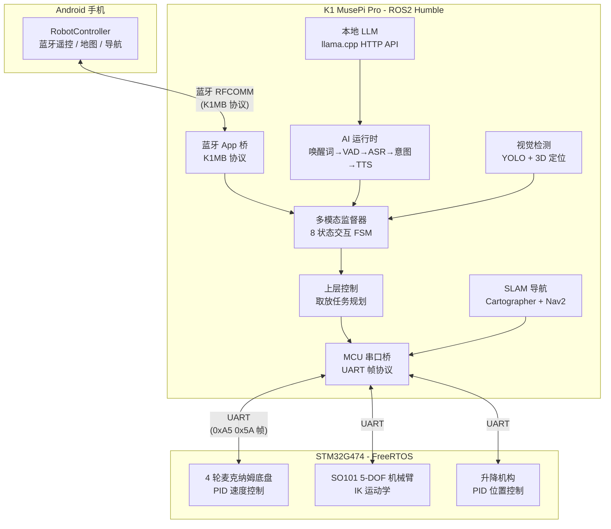

# K1MUSE — 全链路本地具身智能服务机器人

[](LICENSE)
[]()

> [!WARNING]
> ## ⚠️ 重要声明
>
> 本仓库是对真实部署代码的**重构版本**，用于展示**核心算法和系统架构设计**。
>
> **本仓库不能直接部署运行**，原因包括但不限于：
> - 缺少运行时依赖：SpacemiT AI SDK、sherpa-onnx 模型文件、ROS2 系统镜像、Orbbec 相机 SDK 等
> - 部分文件路径、IP 地址、网络配置已从真实部署环境中抽象化
> - 硬件相关文件（设备树、udev 规则、systemd 服务、SSH 密钥路径等）需根据实际硬件调整
> - AI 模型权重文件（唤醒词、ASR、YOLO、TTS 等）未包含在本仓库中
>
> 本仓库仅供**学习、参考和研究**使用。

---

## 项目简介

K1MUSE 是一台基于**进迭时空 K1 (SpacemiT K1) RISC-V 处理器**的全链路本地具身智能服务机器人。所有 AI 推理（语音识别、视觉检测、大语言模型、语音合成）均在边缘端完成，无需云端依赖。

**核心能力：** 语音交互 → 视觉感知 → LLM 理解 → 自主导航 → 机械臂操作

**硬件平台：**
- **主控**: SpacemiT K1 Muse Pi Pro (RISC-V 64-bit, ~2 TOPS NPU)
- **协处理**: STM32G474 (Cortex-M4F, 实时电机控制)
- **传感器**: LD06 激光雷达, YB IMU, Orbbec 深度相机
- **执行器**: 4 轮麦克纳姆底盘 + 可升降 6-DOF 机械臂 + 电动夹爪

## 系统架构



## 仓库结构

```
k1muse/
├── firmware/          STM32G474 FreeRTOS 固件（底盘/机械臂/升降台）
├── ros2/              所有 ROS2 包
│   ├── navigation/    导航与通信（SLAM, MCU 桥, 蓝牙桥, LiDAR, IMU）
│   ├── ai/            AI 运行时（语音/视觉/LLM/多模态监督器）
│   └── control/       上层控制（取放任务, 抓取配置, STM32 串口客户端）
├── android/           Android 蓝牙遥控器（Kotlin/Jetpack Compose）
├── hardware/          硬件设计（3D CAD, PCB, MATLAB 运动学, URDF）
├── docs/              集中文档（架构, 协议, 快速入门）
└── tools/             开发工具脚本
```

## 快速导航

| 我想... | 查看 |
|---------|------|
| 了解底盘控制算法 | [`firmware/Application/Module/mdl_chassis.c`](firmware/Application/Module/mdl_chassis.c) |
| 了解机械臂 IK 运动学 | [`firmware/Application/Module/SO101ARM/so101_algorithm.c`](firmware/Application/Module/SO101ARM/so101_algorithm.c) |
| 了解 AI 运行时架构 | [`ros2/ai/k1muse_ai_runtime/`](ros2/ai/k1muse_ai_runtime/) |
| 了解多模态交互 FSM | [`ros2/ai/k1muse_multimodal_supervisor/`](ros2/ai/k1muse_multimodal_supervisor/) |
| 了解语音意图路由 | [`ros2/ai/k1muse_voice_intent/`](ros2/ai/k1muse_voice_intent/) |
| 了解取放任务规划 | [`ros2/control/k1muse_control_core/`](ros2/control/k1muse_control_core/) |
| 了解通信协议 | [`docs/protocol.md`](docs/protocol.md) |
| 了解 Android App | [`android/`](android/) |
| 了解机械结构 | [`hardware/cad/`](hardware/cad/) |
| 了解 PCB 设计 | [`hardware/pcb/`](hardware/pcb/) |

## 关键技术指标

| 指标 | 数值 |
|------|------|
| AI 推理延迟（语音→意图） | < 2s（全本地） |
| SLAM 建图精度 | 0.05m 分辨率 |
| 机械臂重复定位精度 | ±1.5cm |
| 底盘最大速度 | 1.4 m/s |
| 升降行程 | 0.5m |
| 机械臂工作半径 | 0.5m |
| 蓝牙地图传输 | zlib 压缩分块, 最大 4MiB |

## 许可

- **软件代码** (`firmware/`, `ros2/`, `android/`, `tools/`): [Apache License 2.0](LICENSE)
- **硬件设计** (`hardware/`): [CC-BY-SA 4.0](hardware/README.md)
- **文档** (`docs/`): [CC-BY 4.0](docs/)

第三方代码（STM32 HAL, FreeRTOS, CMSIS, LDROBOT 激光雷达驱动等）保留其原始许可。

## 相关链接

- 进迭时空 K1: https://www.spacemit.com
- ROS2 Humble: https://docs.ros.org/en/humble/
- Cartographer: https://google-cartographer-ros.readthedocs.io/
- Nav2: https://navigation.ros.org/
- sherpa-onnx: https://github.com/k2-fsa/sherpa-onnx
