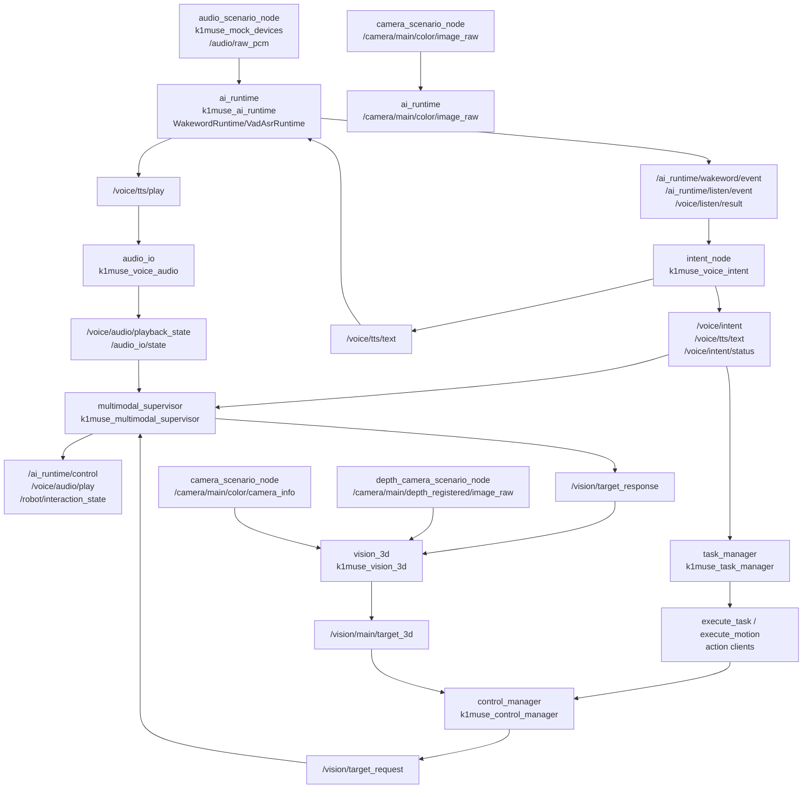

# Current V1 Runtime Flow

Last rebuilt: 2026-06-26

This document traces the current V1 runtime from launch files and node source. It separates current code facts from old design and future plans.

## Primary V1 Entry

The primary current V1 entry is:

```bash
ros2 launch k1muse_robot_bringup robot.mock.launch.py
```

Evidence: `k1muse_manager_ros/src/k1muse_robot_bringup/launch/robot.mock.launch.py`.

The primary board preparation entry is:

```bash
ros2 launch k1muse_robot_bringup robot.real_k1.launch.py
```

Evidence: `k1muse_manager_ros/src/k1muse_robot_bringup/launch/robot.real_k1.launch.py`.

`robot.real_motion.launch.py` is not a V1 main entry. It includes `robot.mock.launch.py` and then starts additional manager nodes with real configs, so it can duplicate `task_manager` and `control_manager` processes. It also comments that `k1muse_communicate_ros` and `k1muse_slam_ros` are required separately.

## Launch Loading Order

`robot.mock.launch.py` returns a `LaunchDescription` in this order:

1. Declares `autostart`.
2. Includes `k1muse_ai_runtime/launch/ai_runtime.mock.launch.py`.
3. Starts lifecycle `audio_io`.
4. Registers configure/activate events for `audio_io`.
5. Starts `intent_node`.
6. Starts `multimodal_supervisor`.
7. Starts `task_manager`.
8. Starts `control_manager`.
9. Starts `reminder_node`.
10. Starts `vision_3d`.
11. Starts `audio_scenario_node`.
12. Starts `camera_scenario_node`.
13. Starts `depth_camera_scenario_node`.

`ai_runtime.mock.launch.py` starts lifecycle `ai_runtime` and autostarts configure and activate.

Important: launch order is not proof that every topic path is connected. Topic names still need to match node source.

## V1 Mock Runtime Diagram



Camera edges above reflect the current code contract after topic alignment. The real camera package is external to this workspace, so board runtime validation is still required.

## Detailed Step Table

| Step | Node/package | Input | Output | Key config | Code evidence | Status |
|---|---|---|---|---|---|---|
| 1 | `ai_runtime` / `k1muse_ai_runtime` | lifecycle configure/activate | `/ai_runtime/state`, runtime publishers/subscribers | `config/ai_runtime.mock.yaml` | `launch/ai_runtime.mock.launch.py`, `src/ai_runtime_node.cpp::on_configure` | Implemented |
| 2 | `audio_io` / `k1muse_voice_audio` | lifecycle configure/activate | `/audio_io/state`, `/audio/raw_pcm`, `/voice/audio/playback_state` | `config/audio.mock.yaml` or `config/audio_io.real_k1.yaml` | `src/audio_io_node.cpp::on_configure`, `::on_activate` | Implemented/partial |
| 3 | `audio_scenario_node` / `k1muse_mock_devices` | timer | `/audio/raw_pcm` | inline launch params `scenario`, `publish_rate_ms` | `src/audio_scenario_main.cpp` | Mock only |
| 4 | `ai_runtime` voice input | `/audio/raw_pcm` | wake/listen/result topics | `wakeword_*`, VAD/ASR params in `ai_runtime.*.yaml` | `src/ai_runtime_node.cpp::on_audio_frame`, `WakewordRuntime`, `VadAsrRuntime` | Implemented/partial |
| 5 | `intent_node` / `k1muse_voice_intent` | `/voice/listen/result` | `/voice/intent`, `/voice/tts/text`, `/voice/intent/status`, `/intent/state` | `intent.mock.yaml` or `intent.real_k1.yaml` | `src/intent_node.cpp::on_listen_result`, `::process_intent`; `src/intent_router.cpp`; `src/fast_intent.cpp`; `src/llama_server_client.cpp` | Implemented for V1 intent hardening; current board structured output uses `json_object` by user confirmation |
| 6 | `multimodal_supervisor` | runtime, wake/listen, intent, TTS, audio, target topics | `/ai_runtime/control`, `/voice/audio/play`, `/vision/target_response`, `/robot/interaction_state` | `supervisor.mock.yaml` | `src/multimodal_supervisor_node.cpp` subscriptions and publishers | Implemented |
| 7 | `ai_runtime` TTS | `/voice/tts/text` | `/voice/tts/status`, `/voice/tts/play` | TTS provider/model params | `src/ai_runtime_node.cpp::on_tts_text_request`, `TTSRuntime` | Implemented/partial |
| 8 | `audio_io` playback | `/voice/tts/play`, `/voice/audio/play` | `/voice/audio/playback_state` | playback config/preset | `src/audio_io_node.cpp::on_tts_request`, `::on_audio_request`, `::worker_loop` | Implemented/partial |
| 9 | `task_manager` | `/voice/intent` | `execute_task`, `execute_motion`, stop/reset service clients, `/manager/task_status` | `task_manager.mock.yaml` | `src/task_manager_node.cpp::on_intent` | Partial |
| 10 | `control_manager` | `execute_task`, `execute_motion`, stop/reset services, target response/3D | `/vision/target_request`, `/cmd_vel`, `/control/motion_state` | `control_manager.mock.yaml` or `control_manager.real.yaml` | `src/control_manager_node.cpp`, `relative_motion_executor.cpp` | Mock in V1; real motion future |
| 11 | `camera_scenario_node` | timer | `/camera/main/color/image_raw`, `/camera/main/color/camera_info` | defaults in source | `src/camera_scenario_node.cpp` | Mock RGB/info source aligned with runtime topics |
| 12 | `ai_runtime` vision input | `/camera/main/color/image_raw` | `/vision/detection_2d` | `vision_provider`, model params | `src/ai_runtime_node.cpp::on_image_frame`, publisher around `/vision/detection_2d` | Topic aligned; backend/model runtime still partial |
| 13 | `depth_camera_scenario_node` | timer | `/camera/main/depth_registered/image_raw`, extra `/camera/main/depth_registered/camera_info` | defaults in source | `src/depth_camera_scenario_node.cpp` | Mock; current `vision_3d` consumes color camera_info instead |
| 14 | `vision_3d` | `/vision/detection_2d`, `/camera/main/depth_registered/image_raw`, `/camera/main/color/camera_info`, `/vision/target_response` | `/vision/main/target_3d` | `vision_3d.mock.yaml` | `src/vision_3d_node.cpp` | Topic/config aligned; runtime timestamp/depth validation pending |
| 15 | `reminder_node` | `/voice/intent` | `/voice/tts/text` | `reminder.mock.yaml` | `src/reminder_node.cpp` | Implemented for V1 |

## Voice Chain

Mock audio input:

```text
k1muse_mock_devices/audio_scenario_node
  publishes /audio/raw_pcm
  -> ai_runtime subscribes /audio/raw_pcm
```

Evidence:

- publisher: `k1muse_core_ros/src/k1muse_mock_devices/src/audio_scenario_main.cpp`
- subscriber: `k1muse_core_ros/src/k1muse_ai_runtime/src/ai_runtime_node.cpp`
- interface: `k1muse_core_ros/src/k1muse_audio_msgs/msg/AudioFrame.msg`

`ai_runtime` creates and uses:

- `WakewordRuntime`: `include/k1muse_ai_runtime/models/wakeword_runtime.hpp`, `src/models/wakeword_runtime.cpp`
- `VadAsrRuntime`: `include/k1muse_ai_runtime/models/vad_asr_runtime.hpp`, `src/models/vad_asr_runtime.cpp`
- backend selection: `src/backend_factory.cpp`
- scheduling: `RuntimeScheduler`, `ResourceGuard`, `BoundedCpuWorker`

Outputs:

- `/ai_runtime/wakeword/event`: `k1muse_voice_msgs/msg/WakewordEvent.msg`
- `/ai_runtime/listen/event`: `k1muse_voice_msgs/msg/ListenEvent.msg`
- `/voice/listen/result`: `k1muse_voice_msgs/msg/ListenResult.msg`
- `/ai_runtime/state`: `k1muse_ai_runtime_msgs/msg/AiRuntimeState.msg`

Intent and TTS relation:

```text
/voice/listen/result
  -> intent_node
    -> fast intent or LLM client
    -> /voice/intent
    -> /voice/tts/text
  -> ai_runtime
    -> TTSRuntime
    -> /voice/tts/status
    -> /voice/tts/play
  -> audio_io
    -> playback backend
    -> /voice/audio/playback_state
```

Current hardened intent behavior:

1. `intent_node` receives `ListenResult` and starts a traced request with `trace_id`, `request_id`, `utterance_id`, `epoch`, text length and LLM mode.
2. `IntentRouter` cleans ASR text and asks `MatchFastIntentCandidate` for a deterministic candidate.
3. Fast candidates carry `FastIntentCategory`, `SlotState` and route reason. Safety stop, clear short action, query/chat and valid extractive find/reminder paths can publish without LLM.
4. Complex or ambiguous input can call the real LLM client. Current board runtime uses OpenAI-compatible `response_format=json_object` according to user confirmation; code also supports `json_schema` for future stabilization.
5. LLM output remains intentionally flat: `{"kind":"","direction":"","target":"","reply":""}`. `LlmResponseValidator` validates the four-field object and `LlmIntentMapper` converts it into `IntentDecision`.
6. Unsafe or incomplete results are contained by router fallback. Examples: bare `提醒我` becomes ask-repeat; `lift` maps to `action=lift,target=lift`; long destination-like movement is not blindly sent as a relative move.
7. Runtime logs include `route_source`, `fast_category`, `fast_slot`, `fast_reject_reason`, `llm_status`, `response_format`, intent/action/target/value and request latency.

Evidence:

- Fast and route policy: `k1muse_core_ros/src/k1muse_voice_intent/src/fast_intent.cpp`, `src/intent_router.cpp`.
- LLM validation/mapping: `src/llm_response_validator.cpp`, `src/llm_intent_mapper.cpp`.
- Structured output support: `src/llama_server_client.cpp`, `include/k1muse_voice_intent/llama_server_client.hpp`.
- Runtime logs and ROS params: `src/intent_node.cpp`, `config/intent.real_k1.yaml`.
- Current `json_object` usage: user-confirmed board runtime fact on 2026-06-26.
Real LLM status:

- `intent.real_k1.yaml` sets `llm_backend: "real"` and `llm_api_base: "http://127.0.0.1:8080/v1"`; it also carries route-policy and structured-output parameters.
- `k1muse_voice_intent/CMakeLists.txt` has `K1MUSE_ENABLE_REAL_LLM_CLIENT` default ON and compiles `llama_server_client.cpp` when enabled.
- `llama_server.real_k1.yaml` says `intent_node` does not parse it. Treat it as board process support, not current node config evidence. Current board structured-output mode is `json_object` by user confirmation; switching to `json_schema` is a future stability/latency tradeoff task.

## Vision Chain

Current source topics:

```text
camera_scenario_node
  publishes /camera/main/color/image_raw
  publishes /camera/main/color/camera_info

ai_runtime
  subscribes /camera/main/color/image_raw
  publishes   /vision/detection_2d

depth_camera_scenario_node
  publishes /camera/main/depth_registered/image_raw
  publishes /camera/main/depth_registered/camera_info

vision_3d
  subscribes /vision/detection_2d
  subscribes /camera/main/depth_registered/image_raw
  subscribes /camera/main/color/camera_info
  subscribes /vision/target_response
  publishes  /vision/main/target_3d
```

Evidence:

- mock RGB: `k1muse_core_ros/src/k1muse_mock_devices/src/camera_scenario_node.cpp`
- AI runtime image subscription: `k1muse_core_ros/src/k1muse_ai_runtime/src/ai_runtime_node.cpp`
- mock depth: `k1muse_core_ros/src/k1muse_mock_devices/src/depth_camera_scenario_node.cpp`
- 3D node: `k1muse_core_ros/src/k1muse_vision_3d/src/vision_3d_node.cpp`

Current limitation:

- The static topic contract is now aligned to the user-confirmed real camera topics: `/camera/main/color/image_raw`, `/camera/main/depth_registered/image_raw`, `/camera/main/color/camera_info`.
- `camera_scenario_node` is a mock publisher in `k1muse_mock_devices`, not the real camera package.
- `depth_camera_scenario_node` still publishes an extra `/camera/main/depth_registered/camera_info` as mock-only legacy output; current `vision_3d` consumes `/camera/main/color/camera_info`.
- The real camera package lives outside this workspace; board smoke must still confirm publishers, QoS, timestamps, and frame IDs.

## AI Runtime Internals

Current `AiRuntimeNode::on_configure` loads runtime config, creates subscribers/publishers, creates model runtimes, creates `RuntimeCore`, loads models, and prepares lifecycle state.

Current V1 path:

- `WakewordRuntime`
- `VadAsrRuntime`
- `VisionRuntime` retained as V1 compatibility path
- `TTSRuntime`
- `RuntimeScheduler`
- `ResourceGuard`
- `BoundedCpuWorker`

V2 skeleton already exists but is not complete V1 behavior:

- `RuntimeCore`
- `VisionPipeline`
- `DetectorRegistry`
- `VisionDetectorScheduler`
- `VoiceExclusiveGuard`
- `RuntimeProfileManager`
- `AlertEventPublisher`
- `MockPoseBackend`
- `MockFireBackend`
- `profiles.yaml`
- `detectors.yaml`

Evidence: `k1muse_core_ros/src/k1muse_ai_runtime/src/ai_runtime_node.cpp`, `include/k1muse_ai_runtime/**`, and related test contracts.

## Supervisor And Manager Relationship

`multimodal_supervisor` is the current interaction-state owner:

- subscribes runtime/voice/audio/vision readiness and result topics
- publishes `/ai_runtime/control`
- publishes `/voice/audio/play`
- publishes `/vision/target_response`
- publishes `/robot/interaction_state`

Evidence: `k1muse_core_ros/src/k1muse_multimodal_supervisor/src/multimodal_supervisor_node.cpp`.

`task_manager` routes `IntentLite` to manager actions/services:

- subscribes `/voice/intent`
- action client `execute_task`
- action client `execute_motion`
- service clients `stop_and_latch`, `reset_latch`
- publishes `/manager/task_status`

Evidence: `k1muse_manager_ros/src/k1muse_task_manager/src/task_manager_node.cpp`.

`control_manager` hosts the action/service side:

- action server `execute_task`
- action server `execute_motion`
- services `stop_and_latch`, `reset_latch`
- publishes `/vision/target_request`
- subscribes `/vision/target_response`, `/vision/main/target_3d`
- optionally creates `RelativeMotionExecutor` when `motion_enabled` is true

Evidence: `k1muse_manager_ros/src/k1muse_control_manager/src/control_manager_node.cpp`, `src/relative_motion_executor.cpp`.

V1 main launches use mock/no-motion manager config. Real motion is a future board task.

## Real Audio Device Fact

`audio_io.real_k1.yaml` currently states:

```yaml
device_type: "alsa"
capture_device: "plughw:2,0"
playback_device: "plughw:2,0"
capture_sample_rate: 16000
capture_channels: 1
capture_frame_ms: 20
```

`robot.real_k1.launch.py` uses this file for `audio_io`. This is config evidence, not hardware proof. Board validation still requires `arecord`, `aplay`, ROS topic checks, and runtime logs.

## Current, Old, Future Boundary

| Item | Status | Why |
|---|---|---|
| `robot.mock.launch.py` chain | Current V1 | Starts maintained packages and mock devices. |
| `robot.real_k1.launch.py` no-motion board chain | Board preparation | Uses real configs but no stored board smoke evidence. |
| `robot.real_motion.launch.py` | Future/unsafe as V1 mainline | Includes mock launch and duplicates manager nodes. |
| SLAM/Nav2 | Future | No V1 main launch inclusion. |
| MCU bridge | Future | Only mentioned as external requirement in real-motion launch comments. |
| OCR/RapidOCR | Future/not implemented | Current ROS2 source search found no V1 integration. |
| V2 Pose/Fire mode system | Future/skeleton | Interfaces and classes exist; full pipeline and packages are not integrated as V1 behavior. |
